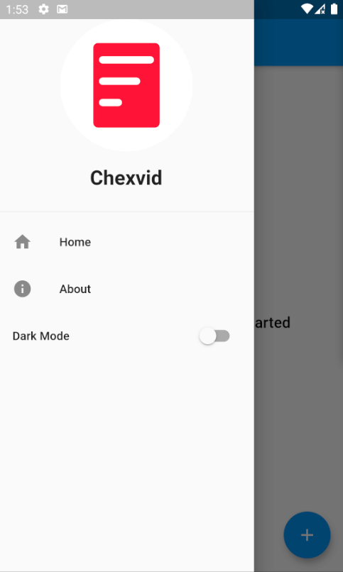
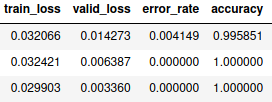
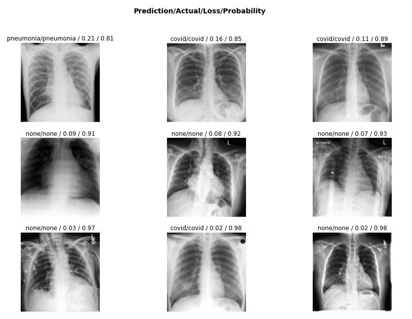

# Chexvid
**Checks Covid through Chest X-rays with 100% accuracy. It can classify your X-ray into three categories: Covid, Pneumonia, and None** (This is not the real repo of Chexvid. It only contains the readme of it)
# Content
- [Features](#Features)
- [Mobile App](#Mobile)
- [Website](#Website)
- [Api](#Api)
- [Clarifications](#Clarifications)

# Features<a name="Features"></a>
- **Cheap** - Taking chest x-rays are cheaper than Covid test kits. In my country, chest x-rays costs around $10 while Covid test kits cost around $50.
- **Reusable** - X-ray machines can be used to scan up to millions of patients throughout their lifespan while Covid test kits are one-time use only.
- **Instant** - Covid results through chest x-rays come out in less than a second while Covid test kit results can take up to days.
- **Accurate** - The AI model's accuracy is 100%. It got to maintain that accuracy without overfitting. See [Clarifications](#Clarifications).
- **Sustainable** - The Website and Mobile App has been thoroughly tested and doesn't have any errors or bugs. The errors are reported immediately and handled by try catch blocks.

# Mobile App<a name="Mobile"></a>
- The mobile app has been fully tested without any errors. Here is a preview of it:



# Website<a name="Website"></a>
- [Chexvid](https://chexvid.online) also has a website wherein you can upload your x-ray images to have them classified.

# Api<a name="Api"></a>
- Send a Post request to https://chexvid.online/analyze with the following format:
```json
{
  "image": "base64Image"
}
```

- image : Image must be base64 encoded

```json
{
  "predictions": [
    {
      "label": "covid",
      "probability": 0.9999996423721313
    }
  ],
  "tta": false,
  "time": 0.2662327289581299
}
```

- tta : Feature will be added soon
- time: Time it took to predict in seconds

# Clarifications<a name="Clarifications"></a>
- I'm pretty sure that you will doubt that the model can achieve 100% accuracy. It was only able to maintain 100% accuracy on 250 validation images and other test images. I've trained it with 403 images per category (covid, pneumonia, and none). If I got more images of covid x-rays, it would be better since it will have a higher chance of maintaining 100% accuracy.

**Last 3 training results:**



**Top Losses:**


